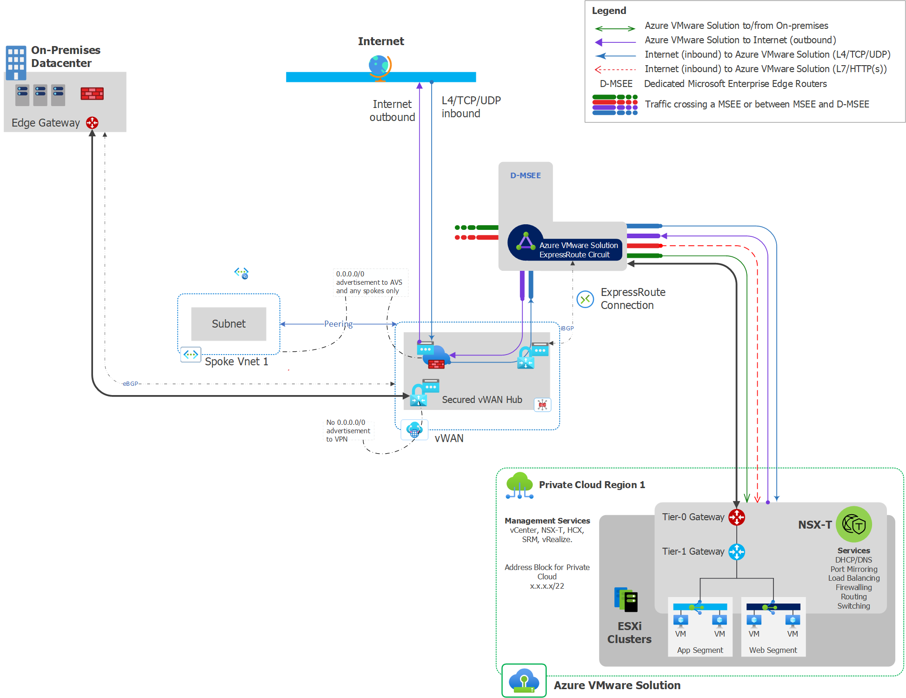

# Implement AVS with new Secure VWAN Hub and VPN hybrid connectivity

## Scenario Details

### Overview
This scenario is meant for new Greenfield customers who want to implement a greenfield AVS environment using VPN to make the hybrid connection. The solution implements a new Secure VWAN hub with VPN and ExpressRoute gateways. The firewall solution in the configuration is an Azure Firewall, due to the current firewall limitations for a secure hub. This document will be updated when routing intent reaches GA. 

This scenario also deploys a spoke Vnet with a bastion and jump host.  These resources can be used for initial setup and testing and then be removed if there are prohibitions against allowing remote virtual machine access from the internet.

### Internet Ingress/Egress
Internet ingress and egress to AVS and Azure VM's will be enabled through one or more public IPs attached to the Azure Firewall in the secure hub. On-premises ingress/egress is expected to use existing configurations and not migrate to the VWAN hub.  <TODO: Add SNAT language?>

### Network Inspection
The solution configures network inspection with the Azure Firewall on the following flows:

Source                    | Azure VMWare Solution | Internet | On-Premises | Spoke Vnets 
---                       | :---:                 | :---:    | :---:       | :---:
**Azure VMWare Solution** | Yes                   | Yes      | Yes         | Yes 
**Internet**              | Yes                   | N/A      | Yes         | Yes 
**On-Premises**           | Yes                   | N/A      | N/A         | Yes 
**Spoke Vnets**           | Yes                   | Yes      | Yes         | Yes

### Assumptions

- Any AVS guest-to-guest inspection will occur in the private cloud using NSX-T's firewall capability 
- Traffic inspection between on-premises sites will be managed by existing equipment and configurations
- If subnet to subnet traffic inspection is required then UDR's will need to be configured on each subnet. <TODO: confirm this statement>

## Scenario Implementation Steps
The steps described below are an outline for deploying this scenario manually. If you wish to use the accompanying automation, then skip to the automation guidance below the manual workflow.

### Manual implementation
These steps represent deploying a configuration using the portal and vcenter.

- Create the required **resource groups** in the target subscription
    - Private Cloud - used to deploy the private cloud and any associated resources
    - Networking  - Used to deploy the firewall, VWAN, and VWAN hub resources
    - Jump/Bastion - Used to deploy the jump host and bastion related resources
- Deploy the **AVS private cloud**
    - Create a private cloud with an initial management cluster
    - Do not enable the internet access toggle as this will be managed in the secure hub
    - Upon deployment completion, create an initial expressroute authorization key for attaching to the VWAN hub
- Create a new **VWAN** resource
    - This is only required if an existing VWAN resource does not already exist
- Create an **Azure Firewall** and **Log Analytics** workspace
    - Create a Log Analytics workspace if one doesn't already exist for the firewall logs 
    - Create the Azure Firewall to use Azure Policy
    - The standard Sku can be used unless premium features are required in the environment
    - Enable the DNS proxy to allow for future DNS configurations
    - Configure the firewall Diags to go the log analytics workspace
- Create an initial Firewall policy for internet access
    - Create new network rule collection for testing
    - Create a new network rule in the rule collection 
        - Source = AVS Address Space, JumpServer Address space
        - Target = *
        - Ports  = 80, 443, 53, 123
        - Protocols = TCP, UDP
- Create a new VWAN virtual hub using the VWAN created previously
    - Deploy an ExpressRoute gateway in the hub
    - Deploy a VPN gateway in the hub
    - Configure the AVS expressRoute connection using the authorization key created previously with the internet security toggle enabled
    - Add a route to the default route table with 0.0.0.0/0 pointing to the resource id of the azure firewall
- Create Service health alerts for the AVS SLA related items
- Create the JumpBox/Bastion Spoke and Services
    - Create the Jumpbox VNET with the following subnets
        - jumpbox (/29 should be sufficient)
        - Bastion (<TODO: add minimum size cidr>)
    - Create the Bastion and Bastion public IP
    - Create a keyvault for storing the jumpbox VM password as a secret
        - Create the keyvault resource
        - Create an Access policy for anyone needing access
        - Create a secret value with the password
    - Create the jumpbox VM
- Test Jump Server connectivity
    - Confirm that the VCenter comes up in a browser
    - Confirm that the jumpserver can access the internet
    - Review firewall logs to validate traffic is crossing the firewall
- Configure the AVS guest network elements (<TODO: validate instructions here>)
    - Set the default DNS to point to the Azure Firewall DNS proxy? (<TODO: validate this is a good practice? Thinking ahead toward using a DNS resolver here>)
    - Configure a new DHCP server
    - Create a new segment and link to the DHCP server
- Deploy a test VM into AVS 
    - <TODO: determine guest configuration and testing >
- Connect the Remote VPN within VWAN
    - Create a VWAN site for both tunnels
        - Configure the Link description 
        - Ensure the proper BGP configuration for the local site VPN
    - Create two VWAN vpn gateway connections 
        - link to the two sites created previously
        - Ensure internet security enabled is set to false
        - Ensure BGP is enabled on the Connection link
        - <TODO: Confirm whether we need two links per connection>
- Create the on-prem connections 
    - Ensure the redundant tunnels are create to each VPN site
    - Validate the BGP configuration
- Test the connectivity
    - Validate the VPN is showing connected on each side of the tunnel
    - From an On-prem system ensure that it can connect to the AVS VM and Jump VM
    - Ensure the AVS and Jump VM's can reach the on-premises VM's
    - Check the firewall logs to ensure traffic is seen on the firewall for each test

### Automation implementation

Multiple automation options exist for deploying this scenario into Azure. Please use the links below to access the desired automation solution.
Solution | Code and Guidance
---                       | :---:  
**Azure ARM templates**   | <TODO: Insert link here>
**Bicep template**        | <TODO: Insert link here>
**Terraform**             | <TODO: Insert link here>
**Powershell**            | <TODO: Insert link here>
**AZ CLI**                | <TODO: Insert link here>

